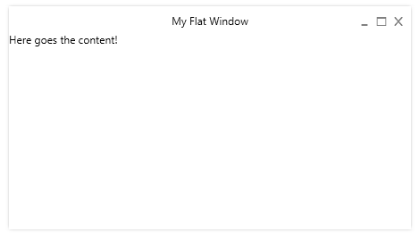

FlatWindow
==========

A reusable, simple flat window control for WPF

**Usage:**

```xml
<simply:FlatWindow x:Class="WindowTest.MainWindow"
        xmlns="http://schemas.microsoft.com/winfx/2006/xaml/presentation"
        xmlns:x="http://schemas.microsoft.com/winfx/2006/xaml"
        xmlns:simply="clr-namespace:Simply;assembly=FlatWindow"
        Title="My Flat Window" Height="250" Width="450">
	<Grid>
		<TextBlock Text="Here goes the content!"/>
	</Grid>
</simply:FlatWindow>
```

**Screenshot:**




**Customize:**

Add Brushes with the Keys "WindowBackground" and "CaptionColor" to your window resource dictionary
```xml
<SolidColorBrush x:Key="WindowBackground" Color="Black" />
<SolidColorBrush x:Key="CaptionColor" Color="White" />
```
